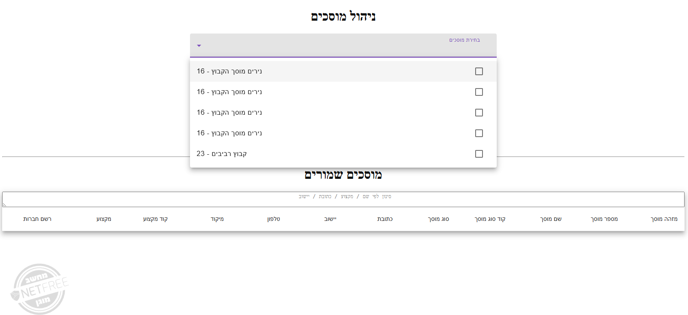
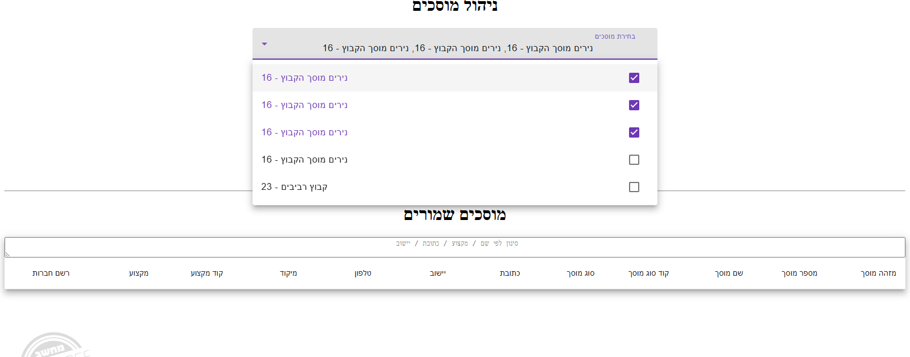
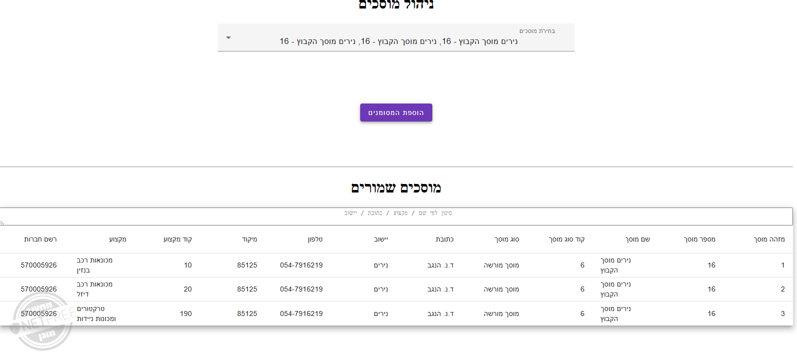

### **Garages Management Application -**

**This application is a Fullstack for managing garage data** 

**the application was developed**  

***Backend*** 

---

* **.**NET 6
* Database : SQL server
* swagger ( for testing )

 

##### ***Frontend***

* Node.js ( latest ) 
* Angular ( version 18 )
* Angular matrial

&nbsp;

##### **How to run - Backend** 

###### 

###### 1\. Install dependencies

###### 

dotnet restore

###### 2\. Configure database connection

###### 

For example  :

desktop-v8slpqq.GaragesDB.dbo "ConnectionStrings": {

"DefaultConnection":

"Server=.;Database=GaragesDb;Trusted\_Connection=True;" }

###### }

&nbsp;API will be available at:

[  https://localhost:7010/swagger/index.html](https://localhost:7010/swagger/index.html)

##### **How to Run – Frontend**

1. **Install packages**

From  the   /garage-client folder open terminal and run

&nbsp;
*npm install*                  

              

<b>2. Start the application </b>

&nbsp;Open the folder in VSCode and run 

*ng* *serve*                      

Frontend will be available at:

[*http://localhost:4200*](http://localhost:4200)

###### <b>  On App Load:</b>

* <i> Calls backend service → which fetches from  government API</i>
* <i>Fills the multi select with garage list</i>
* <i> Load into table  garages from DB</i>
* <i>Display the table under with saved garages
</i>

###### <b> Adding Garages:</b>

* Validates duplicates
* Add only garages from gov API that aren't in DB
* Update the table

### Init application

### Garage Table

### Add Garage Flow

| **Method** | **Endpoint**                | **Description**                                    |

| ------ | ----------------------- | ---------------------------------------------- |

| GET    | `/api/garages/gov` | Fetches data from government API + saves to DB |

| GET    | `/api/garages`          | Retrieves saved garages from DB                |

| POST   | `/api/garages`          | Adds new garage to DB                               |

###### **Bonus Features** 

*User - controlled filters*

                 

